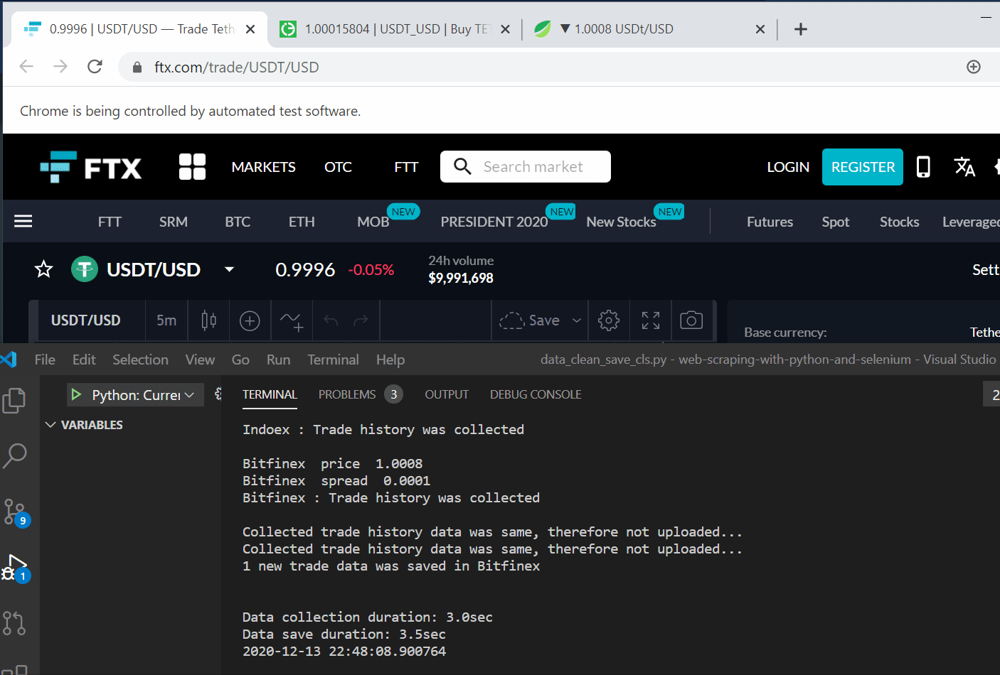

# WEB SCRAPING FROM CRYPTO-EXCHANGES WITH PYTHON&SELENIUM

This python script uses selenium browser to collect Price, Bid-Ask spread and Trade history data from online trade platforms of several crypto-exchanges. Data is being collected continually and stored in mySQL database.

[]

## DEMONSTRATION OF THE RUNNING SCRIPT


##  INSTALLATION
You can clone below repository:  
`git clone https://github.com/serhatci/web-scraping-from-cryptoexchanges.git`

install the requirements:  
`pip install -r requirements.txt`

Be sure following chrome driver file is in the script folder:  
`chromedriver.exe`

You have to provide your own SQL database connection information in the run.py file:
```
    #### BELOW INFORMATION SHOULD BE SUBMITTED ###########
    pair = 'usdt_usd'
    db_name = 'tether'
    host = your_host
    user = your_username
    password = your_passowrds
    ######################################################
```

and run the application:  
`python script/run.py`

##  CUSTOMIZATION
Script uses a JSON file to learn target data for web scraping. Xpath of price, spread and trade history data are declared for each exchange in the script/exchanges.json file as below. You can update the JSON file by adding new exchanges or overwriting the existing ones. Script will handle opening necessary number of the browser windows&tabs and collecting&saving the data.      

```
"FTX": {  
        "name" : "FTX",  
        "web": "https://ftx.com/trade/USDT/USD",  
        "homePageClick": {  
            "clickXpath":"//*[@id='root']/div/div[2]/div/header/div[1]/div[2]/button"},
        "price": {
            "clickXpath": "",
            "xpath": "//*[@id='root']/div/div[2]/div/main/div[1]/div[2]/div/div[3]"},
        "spread": {
            "clickXpath": "",
            "calculate": "Yes",
            "xpathBuy": "/html/body/div/div/div[2]/div/main/div[3]/div[4]/div/div/div[2]/div[2]/table/tbody/tr[1]/td[2]",
            "xpathSell": "//*[@id='root']/div/div[2]/div/main/div[3]/div[4]/div/div/div[2]/div[3]/div/table/tbody/tr[1]/td[1]"},
        "trade": {
            "clickXpath": "",
            "xpath": "/html/body/div/div/div[2]/div/main/div[3]/div[5]/div/table/tbody",
            "order": ["Price","Amount","Time"]}}
   
